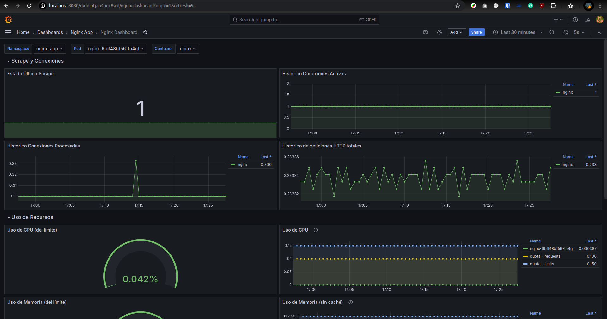
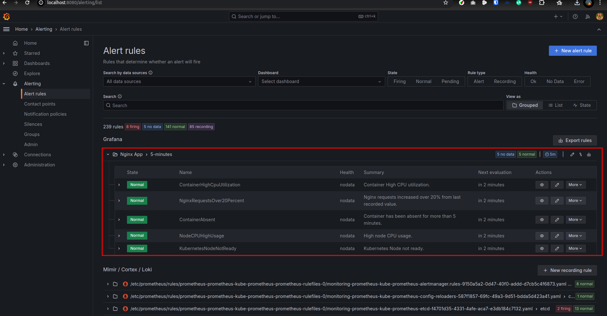
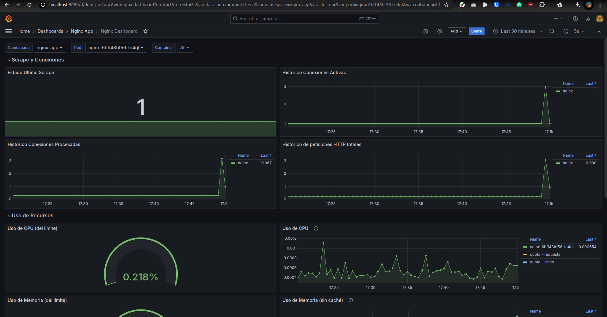

# Whitestack Challenge 2

## Crear Kind Cluster (3 nodos)

kind create cluster --config kind/kind-config.yml

## Implementar Prometheus Operator (kube-prometheus-stack)

kubectl create namespace monitoring

helm install prometheus prometheus-community/kube-prometheus-stack -n monitoring

## Desplegar aplicación Nginx y Service Monitor

- Namespace con label para poder hacer scrape.

```bash
apiVersion: v1
kind: Namespace
metadata:
  name: nginx-app
  labels:
    monitoring: prometheus
```

- Service Monitor para hacer scrape en namespace nginx-app al servicio nginx que expone las métricas.

```bash
apiVersion: monitoring.coreos.com/v1
kind: ServiceMonitor
metadata:
  name: nginx-monitor
  namespace: nginx-app
  labels:
    release: prometheus
spec:
  namespaceSelector:
    matchNames:
    - nginx-app
  selector:
    matchLabels:
      app.kubernetes.io/name: nginx
  endpoints:
  - port: metrics
    path: /metrics
    # interval: 30s
```

## Creación de Dashboard y Alertas en Grafana

- Dashboard



- Alerts



## Prueba de carga y alerta

- Load


